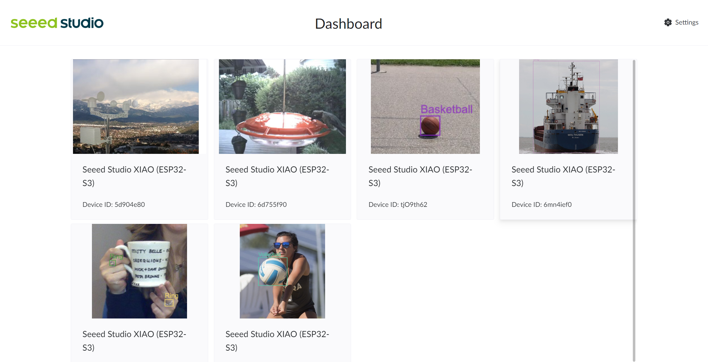

<div align="center">
    <h1>Xiao Dashboard</h1>
</div>

<div align="center">
  
</div>

# Setup


Prerequisite: NodeJS 18+ 


Project is made with Vue3 + Vite + NaiveUI. 

+ Clone the repo

```Shell
git clone https://github.com/parker-int64/Xiao-Dashboard
```

+ Change working directory

```Shell
cd Xiao-Dashboard
```

+ Install dependencies

```Shell
npm install
```

+ Run project in development mode

```Shell
npm run dev
```

If you want to build the project:

```Shell
npm run build
```

Serve project:

```Shell
npm run preview
```

# Cooperate with Docker 

+ If you have docker installed, run project in dev mode:

```Shell
docker compose -f ./dev.compose.yaml up --build 
```

+ Stop the dev server

```Shell
docker compose -f ./dev.compose.yaml down
```

+ To serve the static file with docker:

```Shell
docker compose -f ./serve.compose.yaml up --build 
```

+ Stop serving the static files:

```Shell
docker compose -f ./serve.compose.yaml down
```


